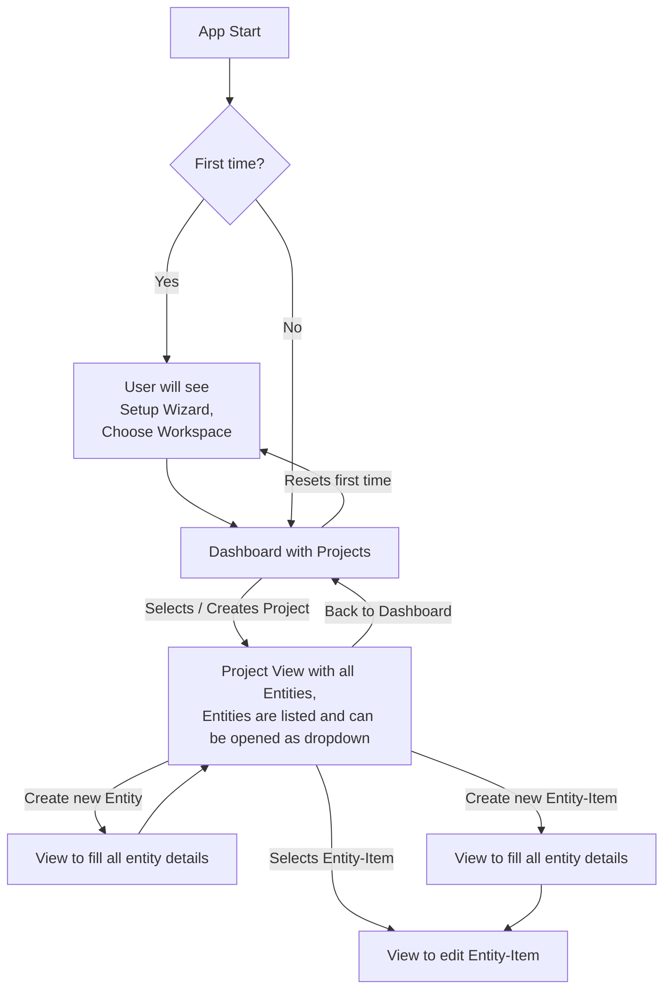

# open-grimoire
An open source editor for world building and writing books

## Installation
> [!IMPORTANT]  
> **Currently there's no installer available!**<br>
> For now you have to clone the repository and run the development setup and build the app yourself.

## Development Setup
```shell
# install dependencies
npm install

# serve the PWA with hot reload for development
npm run pwa:dev

# build the PWA for production
npm run pwa:build

# preview the built PWA with local web server
npm run pwa:preview

# preview the electron app
npm run electron:serve
```

> [!NOTE]  
> `electron:serve` does not work together with `pwa:dev`.<br>
> You have to run `pwa:build` and then `electron:serve` to test the electron app.

## Notes for development
- JSON as file database, each character, ability etc. will have it's own JSON file to avoid large bandwith usage as only that part has to be synced (compared to a database like SQLite)
- Ionic framework will be used with Desktop / Android / PWA (maybe) as target
- iOS will be ignored, requires developer account with 99$ / year and PWA is not really supported with File System API (sorry iOS users, ask apple to be more open)
- VueJS as frontend framework


Steps as a user:
First view -> Overview  of projects + create new ones
Project view -> Overview of "Entities" (characters, abilities, items, locations etc) + can create new entities
Entity view -> Overview of all entities of that type + can create new entities (for example characters)
Entity detail view -> Detail view of that entity + can edit it, add new details etc.

User can choose a location on filesystem where projects are stored
Folder Structure:

```plaintext
open_grimoire/
├─ Project Name/
│  ├─ Characters/
│  │  ├─ entity_config.json
│  │  ├─ Character One.json
│  ├─ Religions/
│  ├─ Custom Entity/
├─ Project Two/
├─ grimoire.json
```

**grimoire.json**<br>
Holds configurations for the app itself (like the location of the projects)

**entity_config.json**<br>
Holds configurations for the entity type, as well as a default configuration for new entities

### Possible classes and their purpose
**App**
- Basically handled by VueJS and Pinia store (`src/stores/grimoire.ts'), no additional class needed
- Holds configurations for the app itself (like the location of the projects, theme etc.)
- We'll use IndexedDB for this config (add a note, that PWA should be used with chrome)
- Holds the `FileSystemDirectoryHandle` for the workspace folder

**Workspace**
- Will probably be a class
- Contains Workspace configurations, persisted into `/workspace-directory/grimoire.json`
- Holds all Projects as an array
- Opening a Workspace will load all projects (no entities)

**Project**
- Will be a class
- Properties: Name, Entities, Image, AttributeDefinitions
- Name = project folder
- Image = project.png
- Opening a Project will load all Entities

**Entity**
- Will be a class
- Properties: Name, Type, EntityItems, DefaultTemplate
- Each entity will have it's own config json file which holds default templates for new entities

**EntityItem**
- Will be a class
- Properties: Name, Components
- Each Entity will be saved as a JSON file in the entity folder

**Component**
- Will be a class
- Properties: Name, Attributes

**Attribute**
- Will be a class
- Are global and can be used in multiple Entities
- Properties: Name, Type, Value ...
- Can be for example a select, input, multiselect ...

### Flowchart of functionality
